# Sterling Digital Solutions: Cloud Migration Project

## Project Overview
This project involves the architectural overhaul of Sterling Digital Solutions' legacy infrastructure. As the Lead Cloudification Officer, I am migrating the firm to a decoupled, resilient AWS environment.

## Architecture
- **Web Layer:** Decoupled static frontend (S3) and dynamic API backend (Node.js on EC2 Auto Scaling).
- **Data Layer:** Multi-AZ RDS (SQL Server) and DynamoDB (NoSQL).
- **Identity/Security:** AWS Simple AD and hardened Bastion Host.

## Documentation
- `/docs`: Service Management Strategy & Architecture Diagrams.
- `/evidence`: Step-by-step screenshots proving the build process.
- `/user-data`: Automation scripts for EC2 instances.

## Status
- [x] Phase 1: Network Foundation (VPC)
**Objective:** Establish a secure, isolated, and highly available network infrastructure for Sterling Digital Solutions.

**Results & Evidence:**
The foundational Virtual Private Cloud (VPC) has been successfully provisioned. The architecture utilizes a strict Multi-AZ deployment strategy to ensure high availability, fault tolerance, and network isolation for the backend databases.

**Creation Logs & Verification:**
The automated deployment successfully generated the VPC, enabled DNS resolution, and provisioned the required network gateways.


**Architectural Resource Map:**
The visual mapping confirms the strict separation of public and private subnets across two Availability Zones (`us-east-1a` and `us-east-1b`).

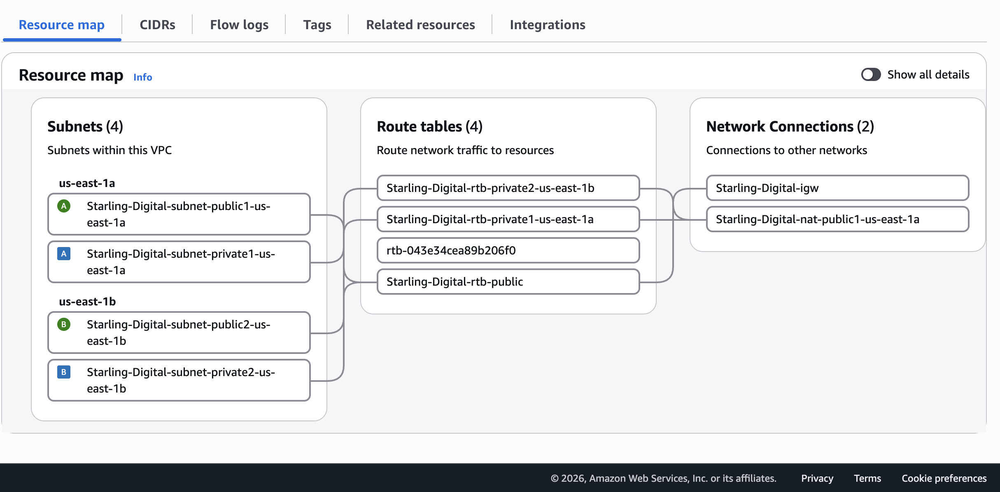

**Deployment Summary:**
*   **VPC Allocation:** Created isolated virtual network `vpc-001de067afb5c3923` with DNS hostnames and resolution enabled.
*   **Multi-AZ Subnetting:** Deployed 4 distinct subnets (2 public, 2 private) across the `us-east-1a` and `us-east-1b` availability zones.
*   **Internet Gateway (IGW):** Attached `igw-0e737a172b6226a33` to the public route table to allow external traffic to the presentation layer.
*   **NAT Gateway:** Allocated Elastic IP `eipalloc-0775653b2d5a91a71` and deployed NAT Gateway `nat-08f82f9082bdac62b` within the public subnet, allowing private database instances to securely download updates without public internet exposure.
*   **Routing:** Configured specific route tables (`Starling-Digital-rtb-public`, `Starling-Digital-rtb-private1-us-east-1a`, and `Starling-Digital-rtb-private2-us-east-1b`) to strictly control internal and external traffic flow.


- [x] Phase 2: Security Groups
**Objective:** Implement a defense-in-depth security strategy by configuring strict, stateful firewall rules to enforce least-privilege access across all architectural tiers.

**Results & Evidence:**
Four distinct security groups have been successfully provisioned within the VPC (`vpc-001de067afb5c3923`). These groups strictly control inbound and outbound traffic flow between the load balancer, bastion host, backend application servers, and the database cluster, ensuring critical internal resources remain completely shielded from public internet exposure.

**Security Group Allocations & Rules:**

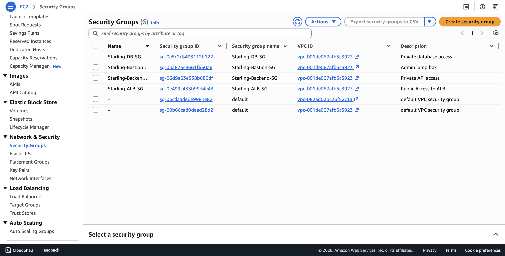

**Deployment Summary:**
*   **Starling-ALB-SG** (`sg-0e499c433b99d4e43`): Exposes only the Application Load Balancer to the public internet, acting as the secure entry point for external web traffic.
*   **Starling-Bastion-SG** (`sg-0ba875c8661f660a6`): Provides a highly restricted, secure administration point for SSH access into the private subnets.
*   **Starling-Backend-SG** (`sg-06d9e63e538b680df`): Keeps application servers strictly private. This group is configured to accept incoming traffic *only* from the Application Load Balancer and administrative commands via the Bastion Host.
*   **Starling-DB-SG** (`sg-0a5c2c8493112b122`): Keeps the database completely isolated. It allows inbound database connections *only* from the verified backend application servers.

  
- [x]  Phase 3: Identity & Bastion
      
**Objective:** Establish secure identity management for internal resources and create a hardened administrative entry point into the private network.

**Results & Evidence:**
A managed AWS Simple AD directory was successfully provisioned to handle identity and access management. Additionally, a secure Bastion Host (jump box) was deployed within the public subnet, providing administrators a secure, monitored bottleneck for SSH access into the private application and database layers.

**Identity & Access Configuration:**

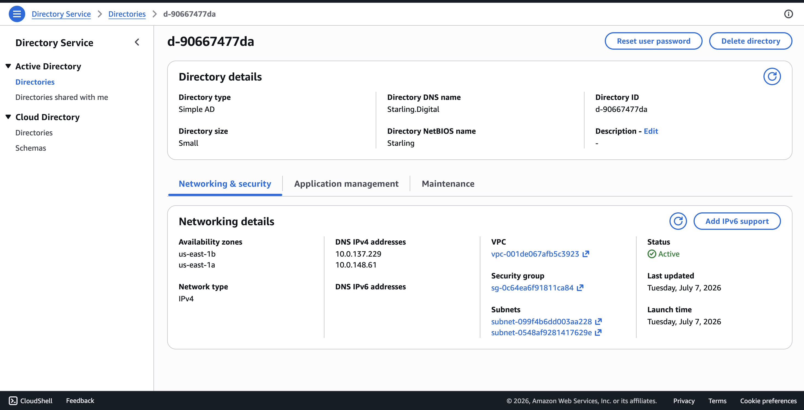
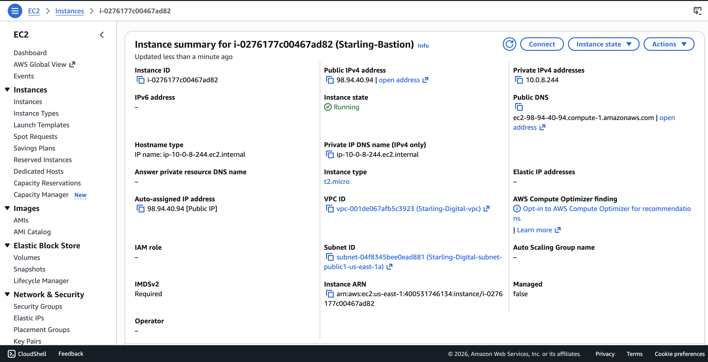

**Deployment Summary:**
*   **Directory Service (Simple AD):** Deployed a standalone managed directory (`d-90667477da`) configured with the DNS name `Starling.Digital` and NetBIOS name `Starling`.
*   **Bastion Host Provisioning:** Launched an EC2 instance (`i-0276177c00467ad82`) named `Starling-Bastion` utilizing a `t2.micro` instance type.
*   **Network Placement:** The bastion is strategically placed in the public subnet (`subnet-04f8345bee0ead881` in `us-east-1a`) to allow secure external ingress.
*   **Access Routing:** The bastion is reachable externally via Public IPv4 `98.94.40.94` and interfaces with the private network via Private IPv4 `10.0.8.244`.

- [x] Phase 4: Storage & Databases
**Objective:** Provision resilient, scalable, and secure data layers to support both relational and non-relational application requirements, as well as shared and object storage needs.

**Results & Evidence:**
The core data and storage infrastructure has been successfully provisioned. This deployment features a highly available relational database subnet group, a NoSQL database for session and market data, elastic file storage for backend application data sharing, and a version-controlled object storage vault.

**Relational Database Service (RDS) Subnets:**

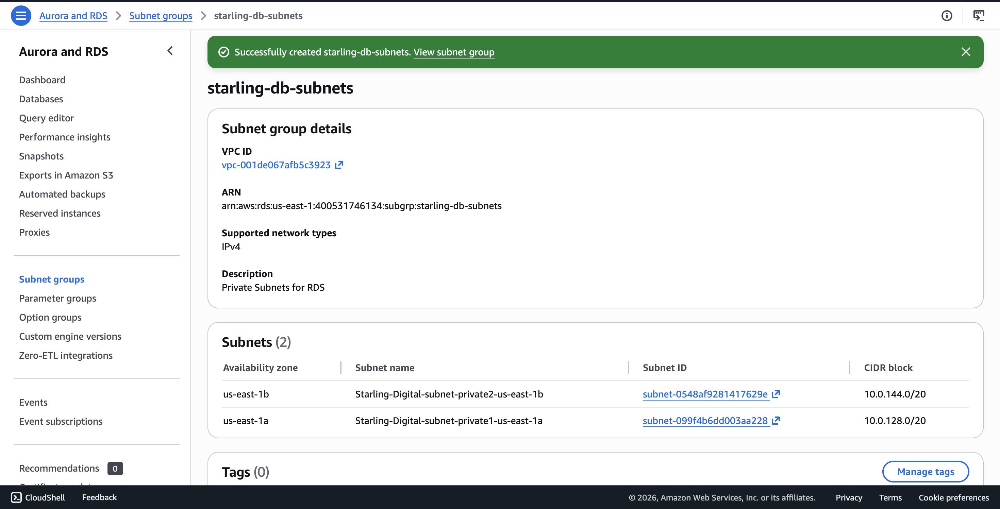

**DynamoDB Configuration:**

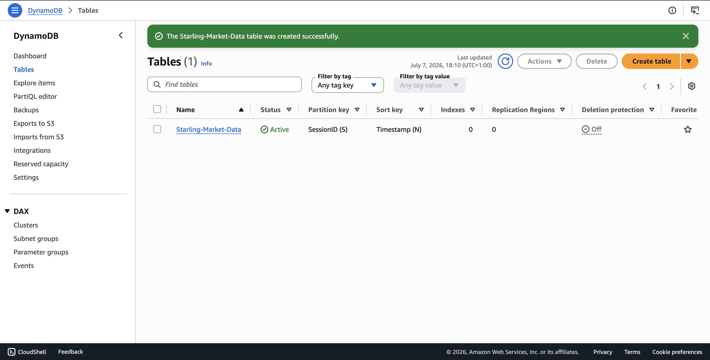

**Elastic File System (EFS) Configuration:**

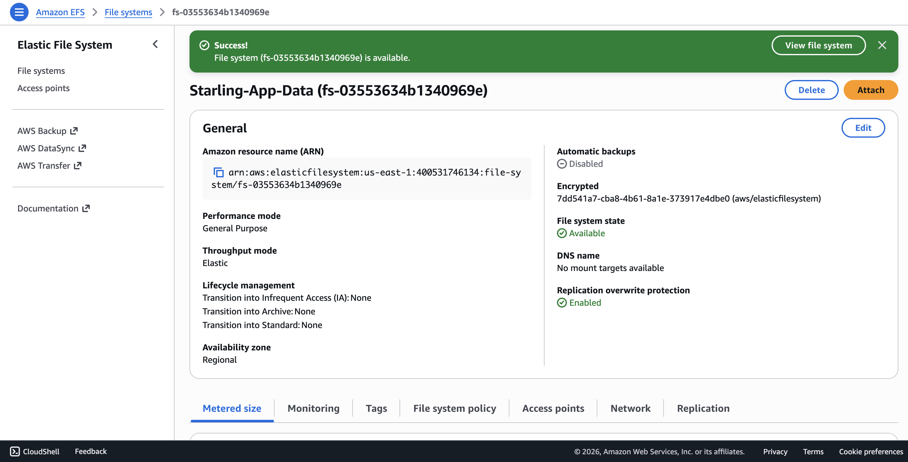

**S3 Bucket Configuration:**

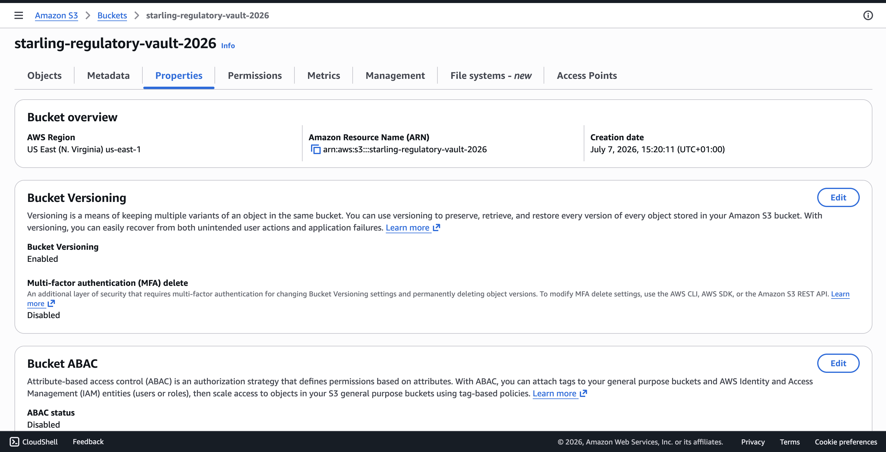

**Deployment Summary:**
*   **RDS Subnet Group:** Created `starling-db-subnets` within the isolated VPC `vpc-001de067afb5c3923`. This group explicitly spans private subnets `subnet-099f4b6dd003aa228` (`us-east-1a`) and `subnet-0548af9281417629e` (`us-east-1b`) to ensure database high availability.
*   **DynamoDB (NoSQL):** Successfully deployed the `Starling-Market-Data` table to handle dynamic data. The table is actively configured with a partition key of `SessionID (S)` and a sort key of `Timestamp (N)`.
*   **Elastic File System (EFS):** Provisioned `Starling-App-Data` (`fs-03553634b1340969e`) to serve as a shared file system for the compute layer. It is configured with General Purpose performance mode and Elastic throughput mode.
*   **S3 Object Storage:** Created the `starling-regulatory-vault-2026` bucket in the `us-east-1` region. Bucket Versioning has been explicitly Enabled to preserve and recover multiple variants of regulatory objects.

- [x] Phase 5: Frontend Deployment
**Objective:** Deploy a secure, high-availability static web presentation layer using Amazon S3 with public read access and object versioning enabled.

**Results & Evidence:**
The presentation layer has been provisioned via an S3 bucket configured for public web hosting, protected by a dedicated bucket policy ensuring strict read control.

**S3 Frontend Bucket Configuration:**

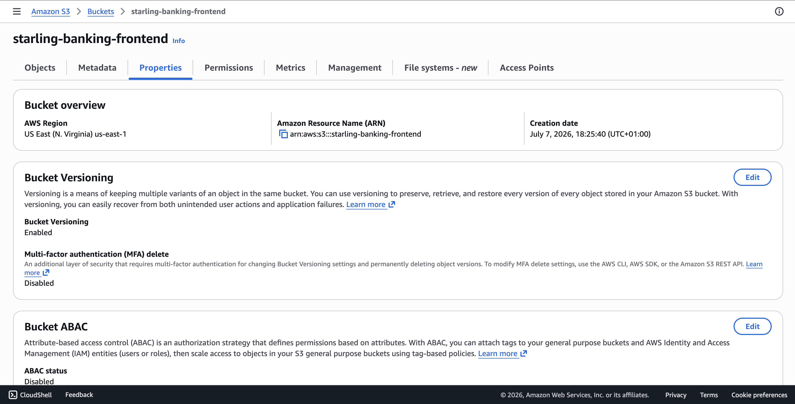

**Public Bucket Policy:**

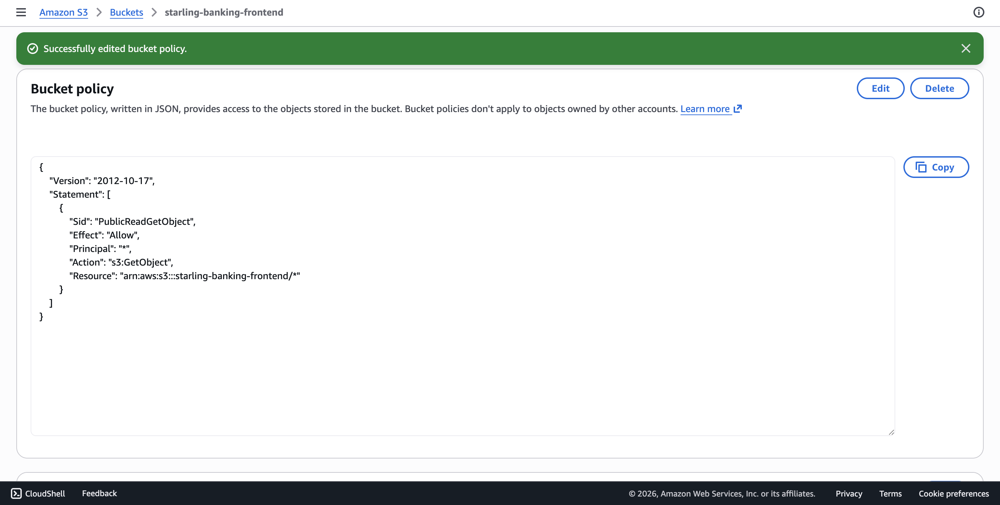

**Deployment Summary:**
*   **Bucket Allocation:** Created `starling-banking-frontend` in the `us-east-1` region.
*   **Versioning:** Bucket Versioning has been explicitly enabled to maintain object history and disaster recovery.
*   **Access Control:** Applied an explicit public read bucket policy allowing `s3:GetObject` actions for public web asset delivery.

- [x] Phase 6: Backend Deployment
**Objective:** Establish a resilient, auto-scaling API compute layer integrated with Active Directory domain joining, shared EFS storage, and automated User Data initialization.

**Results & Evidence:**
The backend dynamic API layer is supported by a Launch Template, an Auto Scaling Group spanning multiple availability zones, and a targeted load balancing configuration. The automated User Data script handles DNS mapping, package installation, domain binding, EFS mounting, and RBAC setup on boot.

**Launch Template Configuration:**

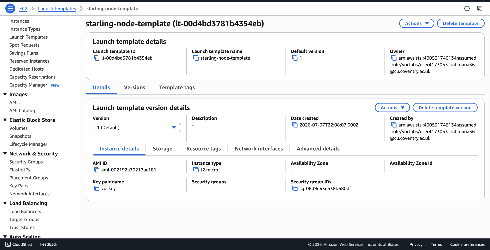

**Auto Scaling Group Overview:**

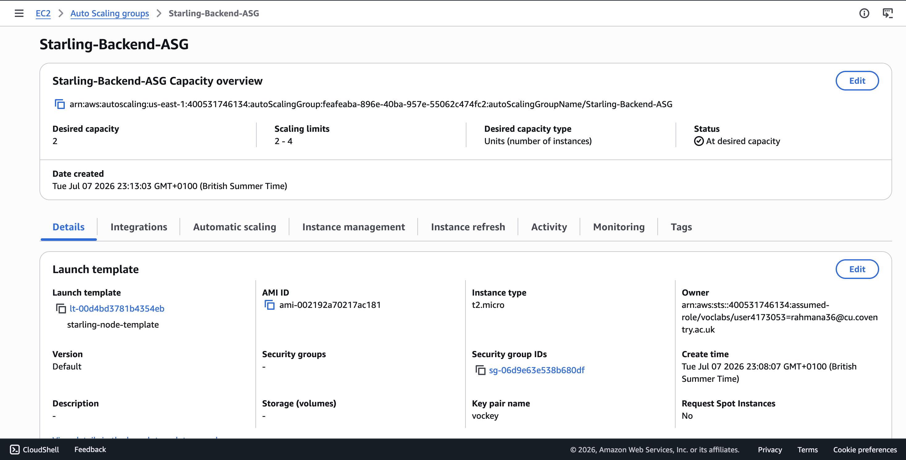

**Target Group Configuration:**

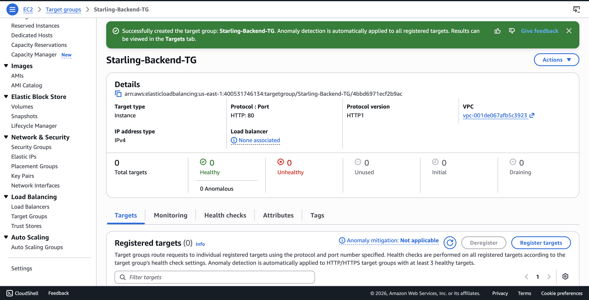

**Deployment Summary:**
*   **Launch Template:** Provisioned `starling-node-template` (`lt-00d4bd3781b4354eb`) utilizing `t2.micro` instances, the custom AMI `ami-002192a70217ac181`, and security group `sg-06d9e63e538b680df`.
*   **Auto Scaling Group:** Deployed `Starling-Backend-ASG` with a desired capacity of 2 and scaling limits set between 2 and 4 instances.
*   **Target Group:** Configured `Starling-Backend-TG` to route HTTP traffic on port 80 across the registered instances within the VPC.

**Instance Initialization Script (User Data):**
```bash
#!/bin/bash
# 1. Fix DNS
echo "nameserver 10.0.137.229" > /etc/resolv.conf
echo "nameserver 10.0.148.61" >> /etc/resolv.conf
 
# 2. Update and install packages
yum update -y
yum install -y sssd realmd adcli samba-common-tools oddjob oddjob-mkhomedir httpd amazon-efs-utils
 
# 3. Join Domain
echo "Starling123" | realm join Starling.Digital -U administrator --verbose
authselect select sssd with-mkhomedir --force
systemctl restart sssd
 
# 4. Mount EFS in background (&) so it doesn't block the boot process
mkdir -p /var/www/html
mount -t efs -o tls fs-03553634b1340969e:/ /var/www/html &
echo "fs-03553634b1340969e:/ /var/www/html efs _netdev,tls 0 0" >> /etc/fstab
 
# 5. Ensure Web Server starts regardless of mount status
systemctl start httpd
systemctl enable httpd
echo '{"status": "success", "message": "Starling Digital API Ready"}' > /var/www/html/index.html
 
# 6. RBAC Setup
groupadd sysadmin_local
groupadd developers_local
usermod -aG sysadmin_local admin@starling.digital
usermod -aG developers_local arif@starling.digital
touch /var/log/financial-audit.log
chown root:sysadmin_local /var/log/financial-audit.log
chmod 660 /var/log/financial-audit.log
